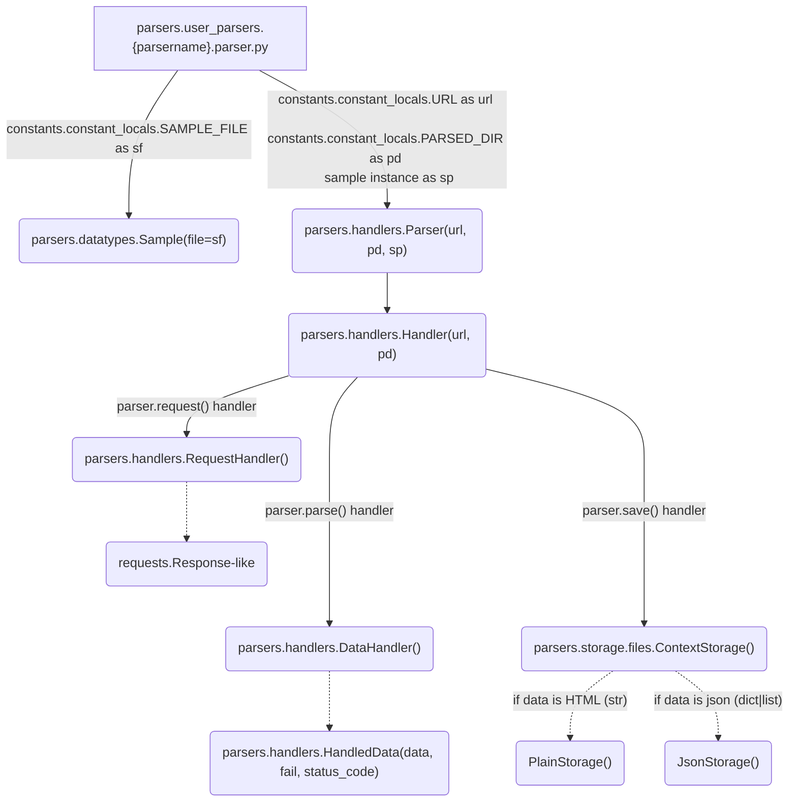

# Parsing tools

[](https://www.python.org/) [](https://unlicense.org)


> __Warning__<br>
This repo may contain inconsistent patterns, bicycles, and just smell bad<br>
Doesn't pretend to be anything, just a way to learn Python


## What is this
There is both a set of unrelated parsing utilities, and preconfigured customizable functionality.<br>
Some subset of code can be used as a framework.

## How it works

Generate a "blank" project environment
```bash
create_parser parsername
```
- Check if the link is correct.<br>
It's ok if the parser name matches SLD like 'https://{parsername}.com'. Whether it happened or not, check the correctness of the URL in 'parsers/user_parsers/{parsername}/constants.py'. Although, [script](scripts/create_parser_template 'This scripts generates {parsername} structures') will probably automatically opens `VSCode` or `Vim` in this place for you to URL check.

- Find out if you need to add "samples".<br>
Sample is a criteria for extracting a certain piece of information. It can be one or list of regex, CSS or Xpath selectors, chain of the mapping keys (_`keypath`_) or object attributes (_`attrpath`_). They will become an argument to `sample_handler(samples)` you implemented in 'parsers/user_parsers/{parsername}/logic.py'.

- `your_parser.main()` starts the `Parser` object.<br>
`Parser` has a `Handler` manager for working with other handlers such as `RequestHandler` to make requests, `DataHandler` for extracting data and `ContextStorage` for saving the final data in json format (_for now_). For any of them, you can inject, redoing part or all to your needs. Good place for this in 'parsers/user_parsers/{parsername}/parser.py'.


#
## Install
```bash
git clone git@github.com:fj-fj-fj/parsers.git && cd parsers
```
Delete unused (examples, tests, etc)
```bash
rm -rf parsers/_prehistoric_parsers/ parsers/user_parsers/*
```

## Prerequisites
Export vars manually or use [`Direnv`](https://github.com/direnv/direnv 'cool shell extension')
```bash
export PATH="$PATH:."
export PROJECT_DIR=$(pwd)
# export VENV=... e.g ."$(basename $PROJECT_DIR)"_venv
# export PYTHONSTARTUP="$(PROJECT_DIR)"/.pythonrc
# export DEBUG=1 or skip
```
Install [requirements](requirements.txt '`pip install -r requirements.txt`') to activated virtual env
```bash
pip install -r requirements.txt
```
Or do it all in one command
```bash
make install
```

#
## Use case
```bash
(3.11.0) $ create_parser sitefoo
# /path/to/forked/parsers/user_parsers/sitefoo
# ├──  __init__.py
# ├──  constants.py
# ├──  logic.py::sample_handlers
# ├──  notes.txt
# ├──  parser.py::main()
# └──  samples.txt
# 0 directories, 6 files

# /path/to/forked/parsers/data/sitefoo/
# 0 directories, 0 files
```

### REPL
Start Python Shell and find data extraction logic
```bash
make irun parsername
```
```python
>>> dir()
[ ... '__parser__', 'constants', 'core', 'info', 'logic', 
'main', 'note', 'parser', 'refresh', 'samples', 'shortcuts']

>>> print(parser.__doc__)
'''
Provides the parsing process core functionality.

    States:
        `_`:
            The last returned value.
            Also: `request._`, `parse._`, `save._`

    Behavior:
        `go`: property
            Encapsulate the Parser primary behavior
        `request(url=None)`:
            Return Response or ResponseLIke
        `parse()`:
            Extract data and return (json or soup) or page
        `less(text: str)`:
            `pydoc.pager` to emulate 'less' in REPL
        `pp`:
            pprint.pprint
        `save()`:
            Save data to Constant.DIR.PARSED_DATA
        `last_result`: property
            Return the last returned value of the Parser object
        `help(method=None)`:
            Display `method` docstring or list all public

'''
>>> # For more information see EXAMPLE.md
>>> ...
```
When the samples are found and their handler is ready, exit the shell and try to run the program.

### Start program
```bash
make run parsername
```
Read docstrings and comments for the modules you have generated.<br>
Maybe you should look also [`.envrc`](.envrc), [`Makefile`](Makefile '`make help`')


#
## Initializations

