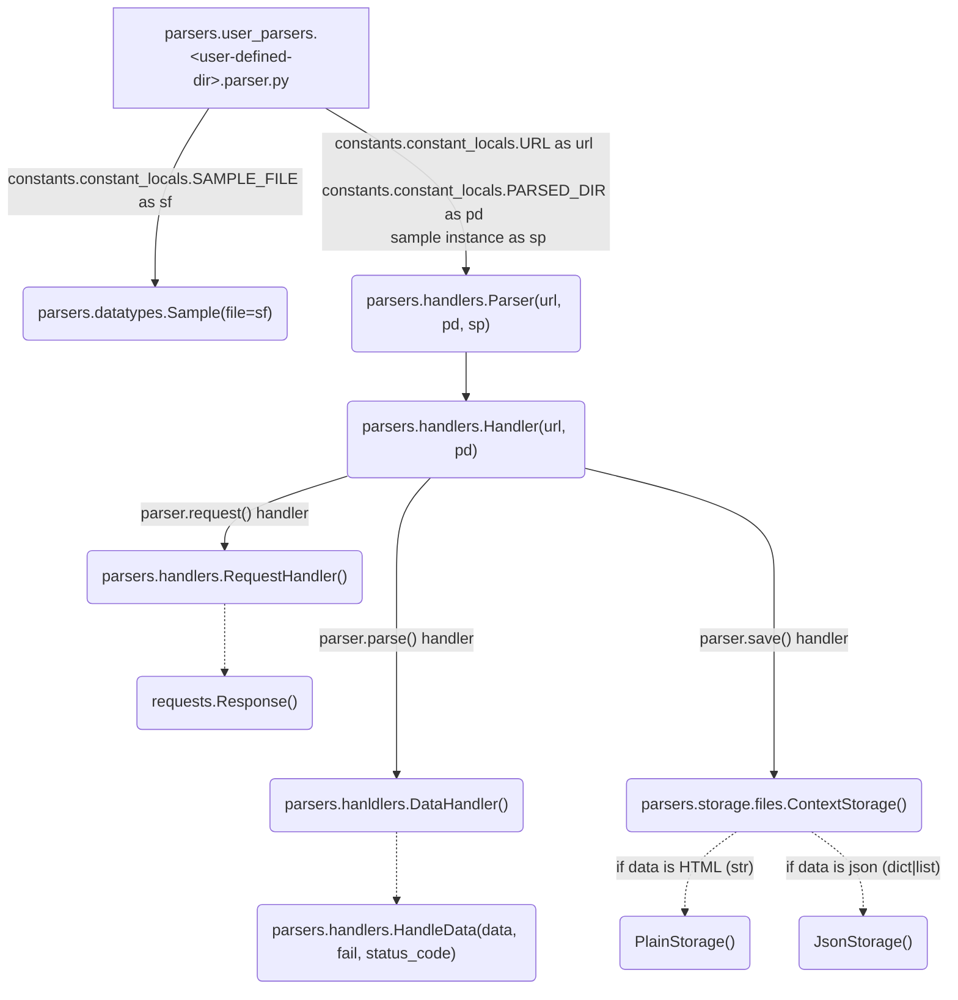

# parsers

[](https://unlicense.org)  


This repo may contain inconsistent patterns, bicycles, and just smell bad
> Doesn't pretend to be anything, just a way to learn Python

#
## What is this
Wrapper for generating parser templates

## How it works
```bash
(3.11.0) $ # 1. Create a parser template
(3.11.0) $ create_parser <parser-name>
(3.11.0) $ #   it's OK if parser's name matches the resource's name:
(3.11.0) $ #     https://<parser-name>.com
(3.11.0) $ #   in any case, check the correctness of the url
(3.11.0) $ #   in parsers/user_parsers/<parser_name>/constants.py
(3.11.0) $ # 2. Start repl and find the data extraction logic
(3.11.0) $ make irun <parser-name>
```
```python
>>> dir()
['__annotations__', '__builtins__', '__cached__', '__doc__', '__file__', '__loader__', 
'__name__', '__package__', '__parser__', '__spec__', 'constants', 'core', 'entry', 
'info', 'logic', 'main', 'note', 'parser', 'refresh', 'samples', 'shortcuts']
>>> print(parser.__doc__)
Provides the parsing process core functionality.

    States:
        `_`:
            The last returned value.
            Also: `request._`, `parse._`, `save._`

    Behavior:
        `go`: property
            Encapsulate the Parser primary behavior
        `request(url=None)`:
            Return Response or its-like object
        `parse()`:
            Extract data and return (json or soup) or page
        `less(text: str)`:
            `pydoc.pager` to emulate 'less' in repl
        `pp`:
            pprint.pprint
        `save()`:
            Save data to Constant.DIR.PARSED_DATA
        `last_result`: property
            Return the last returned value of the Parser object
        `help(method=None)`:
            Display `method` docstring or list all public


>>> # For more information see EXAMPLE.md
```

#
## Initializations


#
## Install
```bash
git clone git@github.com:fj-fj-fj/parsers.git && cd !$
```

### delete unused (examples, old)
###### <i style="gray">du -sh parsers/_prehistoric_parsers/ (3.1M)<i>
```bash
rm -rf parsers/_prehistoric_parsers/ parsers/user_parsers/*
```
