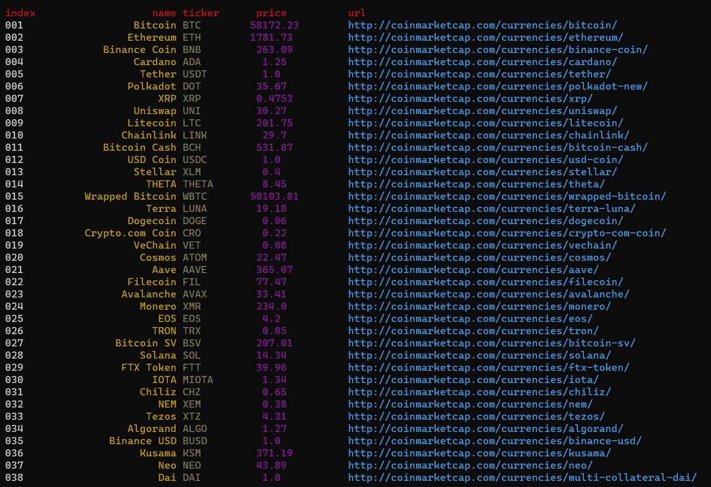

<h1>First hundred coins</h1>

<h2>Task</h2>
<ul>
    <li>Get coinmarketcap home page HTML</li>
    <li>Extract from the table all data on coins from the first hundred</li>
    <li>Clear data and upload to DataFrame</li>
    <li>Save to database</li>
</ul>

<h3>parsers</h3>
<ul>
    <li>coinmarketcap/parser.py </li>
    <li>coinmarketcat/parser2.py <i>(with ORM. Picture below)</i></li>
</ul>

 
<h2>Getting started</h2>

<pre>
<code>git clone https://github.com/fj-fj-fj/parsers.git
cd parsers
pip install -r requirements.txt
python3 path/to/parser</code>
</pre>
