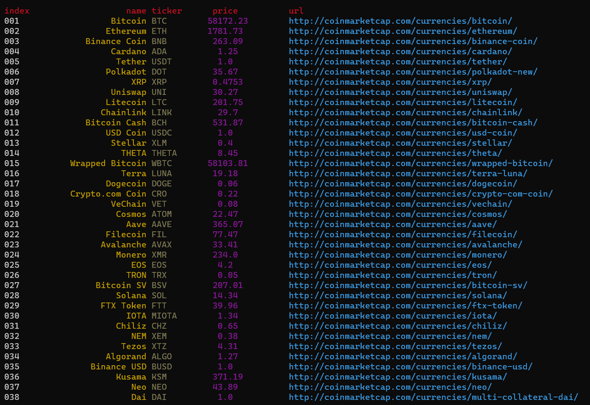

<h2>Parsers</h2>

<h3>coinmarketcap</h3>
<ul>
    <li>coinmarketcap/parser.py </li>
    <li>coinmarketcat/parser2.py <i>(picture below)</i></li>
</ul>

 
<h3>Getting started</h3>

<pre><code>git clone https://github.com/fj-fj-fj/parsers.git
cd parsers
pip install -r requirements.txt
python3 path/to/parser</code></pre>
